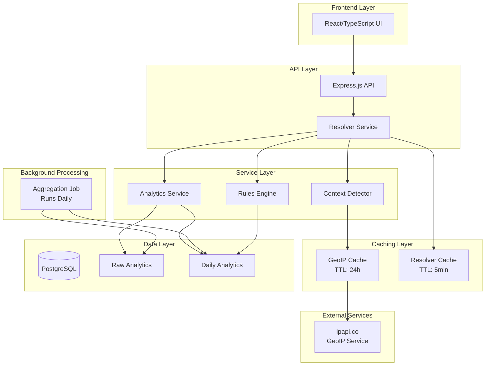

# Design Document: Production Architecture Completion

## Overview

This design completes the production-ready architecture improvements for the Smart Link Hub application. The system currently has a partially upgraded analytics service and a fully upgraded rules engine, but requires completion of several key components to ensure production reliability and performance.

The architecture maintains the hackathon-deployable constraint (no microservices, external queues, or complex infrastructure) while adding production-grade features like caching, background processing, and comprehensive error handling.

## Architecture

### Current State Analysis

**Completed Components:**
- ✅ Rules Engine: Fully upgraded with rule groups, OR/AND logic, performance-based ranking with CTR scoring
- ✅ Database Schema: Updated with DailyAnalytics table for aggregated data
- ✅ Analytics Service: Partially upgraded with dual data sources (aggregated vs raw)

**Remaining Work:**
- ❌ Analytics Service: Missing trackClick and exportAnalytics implementations
- ❌ Background Jobs: No automated aggregation process
- ❌ GeoIP Caching: External API dependency without caching
- ❌ Resolver Caching: No caching layer for frequently accessed data
- ❌ Service Integration: Resolver service not using upgraded components
- ❌ Code Documentation: Marketing claims need honest technical comments
- ❌ Test Coverage: Complex rules engine logic lacks comprehensive tests

### Target Architecture



## Components and Interfaces

### 1. Analytics Service Completion

**Missing Methods Implementation:**

```typescript
interface AnalyticsService {
  // Existing methods (already implemented)
  getHubAnalytics(userId: string, hubId: string): Promise<AnalyticsSummary>;
  getLinkAnalyticsForRules(hubId: number): Promise<Map<number, LinkWithAnalytics>>;
  
  // Methods to implement
  trackClick(linkId: string, hubId: string, data: ClickData): Promise<void>;
  exportAnalytics(userId: string, hubId: string): Promise<string>;
}
```

**Implementation Approach:**
- `trackClick`: Record click events in raw analytics table with full context
- `exportAnalytics`: Generate CSV exports using json2csv library with comprehensive data
- Both methods maintain existing error handling patterns and validation

### 2. Background Aggregation Job

**Job Interface:**
```typescript
interface AggregationJob {
  runDailyAggregation(): Promise<void>;
  aggregateHubData(hubId: number, date: Date): Promise<void>;
  aggregateLinkData(hubId: number, linkId: number, date: Date): Promise<void>;
}
```

**Execution Strategy:**
- Simple setInterval-based scheduling (no external job queue)
- Runs every 24 hours at configurable time (default: 2 AM UTC)
- Processes previous day's raw analytics data
- Upserts into DailyAnalytics table with device/country breakdowns
- Graceful error handling with logging, continues on individual failures

### 3. GeoIP Caching Layer

**Cache Interface:**
```typescript
interface GeoIPCache {
  get(ipAddress: string): Promise<string | undefined>;
  set(ipAddress: string, country: string, ttlHours?: number): Promise<void>;
  clear(): Promise<void>;
}
```

**Implementation Details:**
- In-memory Map-based cache with TTL tracking
- Default TTL: 24 hours (configurable)
- Automatic cleanup of expired entries
- Fallback to cached data when external API fails
- Integration with existing Context Detector

### 4. Resolver-Level Caching

**Cache Interface:**
```typescript
interface ResolverCache {
  get(cacheKey: string): Promise<ResolverResponse | undefined>;
  set(cacheKey: string, response: ResolverResponse, ttlMinutes?: number): Promise<void>;
  invalidateHub(hubId: number): Promise<void>;
  invalidateLink(linkId: number): Promise<void>;
}
```

**Cache Key Strategy:**
- Format: `hub:{hubId}:device:{deviceType}:country:{country}:time:{hourBucket}`
- Time bucketing (hourly) balances cache efficiency with rule accuracy
- Invalidation triggers: hub/link configuration changes, significant analytics changes

### 5. Updated Resolver Service Integration

**Enhanced Resolver Flow:**
1. Check resolver cache for existing response
2. If cache miss, fetch hub and links from database
3. Get analytics data using upgraded Analytics Service
4. Apply rules using upgraded Rules Engine with performance scoring
5. Cache successful responses with appropriate TTL
6. Track visit using Analytics Service

## Data Models

### Enhanced Context Detector

**Updated RequestContext:**
```typescript
interface RequestContext {
  deviceType: 'mobile' | 'desktop' | 'tablet' | 'unknown';
  userAgent: string | undefined;
  ipAddress: string | undefined;
  country?: string; // Now cached with TTL
  timestamp: Date;
}
```

### Cache Data Structures

**GeoIP Cache Entry:**
```typescript
interface GeoIPCacheEntry {
  country: string;
  cachedAt: Date;
  expiresAt: Date;
}
```

**Resolver Cache Entry:**
```typescript
interface ResolverCacheEntry {
  response: ResolverResponse;
  cachedAt: Date;
  expiresAt: Date;
  hubId: number; // For invalidation
}
```

## Correctness Properties

*A property is a characteristic or behavior that should hold true across all valid executions of a system-essentially, a formal statement about what the system should do. Properties serve as the bridge between human-readable specifications and machine-verifiable correctness guarantees.*

Based on the prework analysis and property reflection to eliminate redundancy, the following properties validate the system's correctness:

**Property 1: Click tracking completeness**
*For any* click event with valid context data, the Analytics Service should record all required fields (linkId, hubId, device, country, timestamp) in the raw analytics table
**Validates: Requirements 1.1**

**Property 2: Analytics export completeness**
*For any* hub with analytics data, the export function should generate CSV output containing all analytics records with proper formatting and required columns
**Validates: Requirements 1.2**

**Property 3: Dual data source selection**
*For any* analytics query, the service should use aggregated data when recent aggregates exist, and fall back to raw data when aggregates are unavailable
**Validates: Requirements 1.3, 5.2**

**Property 4: Backward compatibility preservation**
*For any* existing analytics query or smart link configuration, the upgraded services should produce equivalent results to the previous implementation
**Validates: Requirements 1.4, 5.4**

**Property 5: Graceful error handling**
*For any* service method that encounters an error condition, the system should log appropriate messages and continue operating without crashing
**Validates: Requirements 1.5, 2.4, 5.5**

**Property 6: Complete aggregation processing**
*For any* set of raw analytics data for a given date, the aggregation job should process all records and produce corresponding daily analytics entries
**Validates: Requirements 2.2**

**Property 7: Aggregation data persistence**
*For any* completed aggregation run, all computed daily analytics should be correctly stored in the DailyAnalytics table with proper device and country breakdowns
**Validates: Requirements 2.3**

**Property 8: Configuration-driven scheduling**
*For any* valid configuration change to the aggregation job interval, the job should respect the new timing without requiring code changes
**Validates: Requirements 2.5**

**Property 9: Cache-first behavior**
*For any* GeoIP lookup or resolver request, the system should check the appropriate cache before making external calls or performing expensive operations
**Validates: Requirements 3.1, 4.1**

**Property 10: Cache hit efficiency**
*For any* cached entry that is not expired, the system should return cached data without making external API calls or performing full rule evaluation
**Validates: Requirements 3.2, 4.2**

**Property 11: Cache miss handling**
*For any* cache miss or expired entry, the system should fetch fresh data, cache the result with appropriate TTL, and return the fresh data
**Validates: Requirements 3.3**

**Property 12: TTL-based expiration**
*For any* cache entry with a configured TTL, the entry should be considered expired after the TTL period and should not be returned for cache hits
**Validates: Requirements 3.4, 4.5**

**Property 13: Fallback resilience**
*For any* external API failure, the system should return cached data (even if expired) and log appropriate warnings rather than failing completely
**Validates: Requirements 3.5**

**Property 14: Cache invalidation on changes**
*For any* configuration change to hubs or links, the system should invalidate related cache entries to ensure fresh data is used
**Validates: Requirements 4.3, 4.4**

**Property 15: Rules engine integration**
*For any* smart link resolution, the resolver should use the upgraded rules engine with rule groups, OR/AND logic, and performance-based ranking
**Validates: Requirements 5.1, 5.3**

**Property 16: ESM import compliance**
*For any* import statement in backend TypeScript files, the import path should use .js extensions for local modules
**Validates: Requirements 8.1**

**Property 17: Architecture constraint compliance**
*For any* new dependency or service, the system should not introduce microservices, Kafka, Redis, or external queue systems
**Validates: Requirements 8.3**

**Property 18: Type safety enforcement**
*For any* TypeScript code in the system, the TypeScript compiler should pass in strict mode without type errors
**Validates: Requirements 8.5**

<function_calls>
<invoke name="prework">
<parameter name="featureName">production-architecture-completion

## Error Handling

### Graceful Degradation Strategy

**Analytics Service:**
- Database connection failures: Log errors, return empty results rather than crashing
- Export failures: Return meaningful error messages with partial data when possible
- Aggregation failures: Continue with existing aggregated data, log issues for investigation

**Caching Layer:**
- Cache storage failures: Fall back to direct data access, log cache issues
- TTL calculation errors: Use default TTL values, continue operation
- Memory pressure: Implement LRU eviction to prevent memory exhaustion

**External Dependencies:**
- GeoIP API failures: Return cached data (even expired), fall back to 'unknown' country
- Database timeouts: Implement connection pooling and retry logic with exponential backoff
- Network issues: Use circuit breaker pattern for external API calls

### Error Logging Standards

**Log Levels:**
- ERROR: System failures that require immediate attention
- WARN: Degraded functionality that doesn't break core features
- INFO: Normal operation events (cache hits/misses, job completions)
- DEBUG: Detailed troubleshooting information

**Log Format:**
```typescript
interface LogEntry {
  timestamp: string;
  level: 'ERROR' | 'WARN' | 'INFO' | 'DEBUG';
  component: string; // 'analytics', 'cache', 'resolver', etc.
  message: string;
  context?: Record<string, unknown>; // Additional debugging data
  error?: Error; // Full error object for ERROR level
}
```

## Testing Strategy

### Dual Testing Approach

The system requires both unit tests and property-based tests for comprehensive coverage:

**Unit Tests:**
- Focus on specific examples and edge cases
- Test integration points between components
- Verify error conditions and fallback behavior
- Test configuration loading and validation
- Mock external dependencies (GeoIP API, database)

**Property-Based Tests:**
- Verify universal properties across all inputs using fast-check library
- Generate random test data to catch edge cases
- Run minimum 100 iterations per property test
- Each property test references its design document property
- Tag format: **Feature: production-architecture-completion, Property {number}: {property_text}**

### Testing Configuration

**Property-Based Testing Setup:**
```typescript
import fc from 'fast-check';

// Example property test configuration
const propertyTestConfig = {
  numRuns: 100, // Minimum iterations
  timeout: 5000, // 5 second timeout per test
  seed: 42, // Reproducible randomization
};
```

**Test Categories:**

1. **Analytics Service Tests:**
   - Property tests for click tracking completeness
   - Property tests for export data integrity
   - Unit tests for error handling scenarios
   - Integration tests with database

2. **Caching Layer Tests:**
   - Property tests for cache behavior (hit/miss/expiration)
   - Property tests for TTL enforcement
   - Unit tests for memory management
   - Integration tests with external APIs

3. **Background Job Tests:**
   - Property tests for aggregation completeness
   - Unit tests for scheduling configuration
   - Integration tests with database transactions

4. **Resolver Service Tests:**
   - Property tests for rules engine integration
   - Property tests for performance-based ranking
   - Unit tests for backward compatibility
   - Integration tests with all dependencies

5. **Code Quality Tests:**
   - Property tests for import statement compliance
   - Static analysis for architecture constraints
   - TypeScript compiler tests for type safety

### Test Data Management

**Test Database:**
- Use separate test database with isolated transactions
- Seed with representative data for integration tests
- Clean up after each test to prevent interference

**Mock Strategy:**
- Mock external APIs (GeoIP) with configurable responses
- Mock time-dependent functions for TTL testing
- Use dependency injection for testable service composition

**Performance Testing:**
- Benchmark cache performance vs direct database access
- Measure aggregation job execution time with large datasets
- Monitor memory usage during extended cache operations

This comprehensive testing strategy ensures both correctness (through property-based testing) and reliability (through unit and integration testing) while maintaining the system's hackathon-deployable architecture.